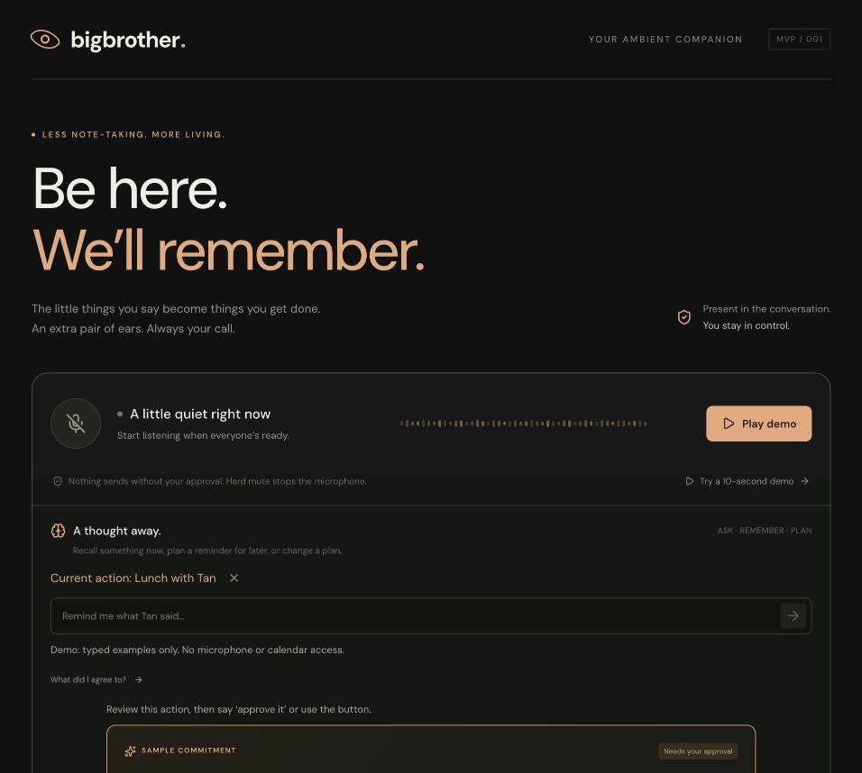
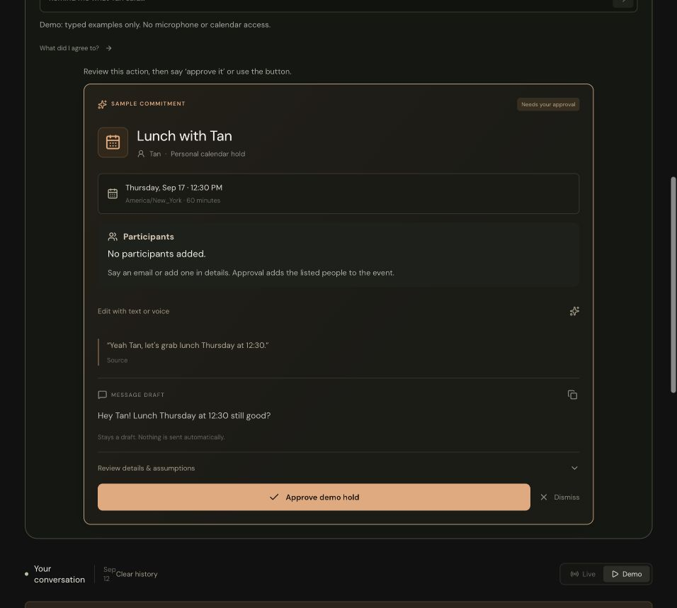
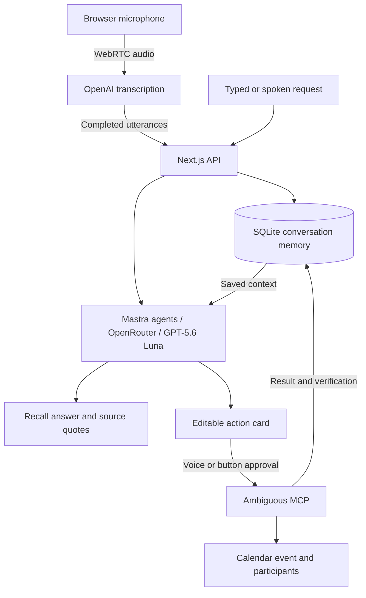

<div align="center">

# BigBrother

### Be here. We’ll remember.

An ambient conversation companion that catches commitments, prepares calendar actions, and remembers what you said.

**Next.js · OpenAI · Mastra · OpenRouter · Ambiguous MCP**

[The idea](#the-idea) · [What it does](#what-it-does) · [Tech stack](#tech-stack) · [Run locally](#run-locally) · [Try the flow](#try-the-flow)

</div>



_The app running locally in demo mode. Sample conversation and simulated actions; no microphone or calendar access._

## The idea

The best plans often start in an ordinary conversation: “Let’s grab lunch Thursday.” Then the conversation moves on, and nobody opens a calendar.

BigBrother grew out of our build plan for the **AI Tinkerers “Agents, Everywhere” hackathon in NYC**. We wanted an agent that becomes useful by being present where commitments happen. It listens while you talk, notices a plan, and prepares the next step for you to review.

The other half is memory. Capturing an event helps with what happens next; recall helps with what already happened. “What did I agree to?” should work even when you never thought to take notes. That is why ambient listening matters to this project.

> **Listen → notice a commitment → propose an action → you approve.**
>
> **The conversation stays available for recall.**

The original plan focused on commitment capture and recall. The MVP now also supports spoken requests, calendar reminders, event edits, contact lookup, and participant additions through the same interface.

## What it does

| In the conversation                     | In BigBrother                                                                    |
| --------------------------------------- | -------------------------------------------------------------------------------- |
| “Let’s grab lunch Thursday at 12:30.”   | Captures the commitment and prepares a calendar proposal.                        |
| “What did I agree to?”                  | Answers from saved conversation, with source quotes when available.              |
| “Remind me in three days to follow up.” | Prepares a calendar reminder for review.                                         |
| “Move it to 3 PM.”                      | Revises a pending proposal or prepares an update to an existing event.           |
| “Add Tan to this event.”                | Resolves a contact in Ambiguous and adds their email to the proposal.            |
| “My email is alex at example dot com.”  | Converts spoken email punctuation into a participant address.                    |
| “Approve it.”                           | Executes the current reviewed action. A button works too.                        |
| “Delete my lunch with Tan.”             | Deletes a uniquely matched event from this session without another confirmation. |

One microphone handles conversation capture, recall, edits, and approval. Responses appear as text near the top of the page; the app does not speak over the conversation. Event cards also support manual editing.

**Creation and edits require approval. Explicit deletion executes immediately.** If a deletion request matches several events, the app asks which one. Message drafts stay in the app; calendar invitations depend on Ambiguous’s settings.



_An action prepared from the sample conversation, waiting for approval._

## Tech stack

These are the components in the running app, based on its source and pinned dependencies.

| Layer           | Technology                                        | Role                                                                       |
| --------------- | ------------------------------------------------- | -------------------------------------------------------------------------- |
| Application     | **Next.js 16.3.5, React 19.3, TypeScript 7**      | Single-page interface and server API routes in one codebase.               |
| Interface       | **Custom CSS, Lucide React, DM Sans**             | Dark theme, action cards, transcript timeline, and recording controls.     |
| Audio           | **WebRTC, browser MediaDevices, Web Audio API**   | Microphone capture, direct audio streaming, and waveform visualization.    |
| Transcription   | **OpenAI `gpt-transcribe`**                       | Converts speech to text using a server-created, short-lived session token. |
| Agent framework | **Mastra 1.66**                                   | Agents for commitment detection, request interpretation, and recall.       |
| Language model  | **GPT-5.6 Luna through OpenRouter**               | Structured decisions using `openai/gpt-5.6-luna`.                          |
| Actions         | **Ambiguous AI + MCP SDK**                        | Calendar creation, updates, deletion, and contact lookup.                  |
| Persistence     | **SQLite through Node’s built-in `node:sqlite`**  | Timestamped transcripts, action proposals, and activity history.           |
| Validation      | **Zod 4**                                         | Validates requests and structured model output.                            |
| Dates           | **chrono-node + date-fns-tz**                     | Natural-language dates, time zones, and daylight-saving transitions.       |
| Checks          | **Node test runner, tsx, TypeScript, Next build** | Automated behavior tests, type checking, and production compilation.       |

The approval UI, voice command handling, and memory retrieval are custom application code. Mastra runs inside Next.js route handlers. The current build uses direct WebRTC and SQLite retrieval; CopilotKit/AG-UI, the OpenAI Agents voice SDK, Mastra Memory, and Exa were considered in the plan but are not integrated.

## How it works



Completed utterances are saved before inference and deduplicated by their transcription IDs. The agent distinguishes recalling something now from scheduling something later. Dates are resolved in the browser’s time zone, with suggested times and durations shown for review.

Calendar actions use stored event IDs, proposal versions, and atomic execution claims to avoid duplicate execution. Updates and deletions verify the provider’s state. An uncertain result blocks automatic retries so the user can check the calendar first.

## Run locally

Requires **Node.js 22.13+** and npm. Development has been tested with Node 24.

```sh
git clone https://github.com/7dracoder/BigBrother.git
cd BigBrother
npm ci
cp .env.example .env.local
npm run dev
```

Open [localhost:3000](http://127.0.0.1:3000) and select **Try a 10-second demo**. This path requires no API keys and simulates the conversation, proposals, approval, and recall. Live and demo histories are separate.

### Connect live services

Fill in `.env.local` using [.env.example](.env.example):

| Variable                     | Value or purpose                                                           |
| ---------------------------- | -------------------------------------------------------------------------- |
| `OPENAI_API_KEY`             | OpenAI key for transcription.                                              |
| `OPENAI_TRANSCRIPTION_MODEL` | `gpt-transcribe` — a direct OpenAI model ID, without the `openai/` prefix. |
| `OPENROUTER_API_KEY`         | OpenRouter key for agent requests.                                         |
| `OPENROUTER_MODEL`           | `openai/gpt-5.6-luna`.                                                     |
| `AMBIGUOUS_MCP_URL`          | `https://app.ambiguous.ai/mcp`.                                            |
| `AMBIGUOUS_API_KEY`          | Your Ambiguous workspace key.                                              |
| `AMBIGUOUS_CALENDAR_TOOL`    | `create_event` for the current adapter.                                    |
| `AMBIGUOUS_CALENDAR_ARGS`    | JSON template with your calendar ID and the provider’s event fields.       |
| `BIGBROTHER_DATA_DIR`        | Defaults to `./data`; stores the local SQLite database.                    |

API keys stay on the server. `.env.local` and local data are ignored by Git. Restart the dev server and reconnect the microphone after changing models or credentials.

<details>
<summary><strong>Calendar configuration and connection checks</strong></summary>

Use the calendar ID from your Ambiguous workspace. The example below matches the event schema used by this MVP:

```dotenv
AMBIGUOUS_CALENDAR_ARGS={"calendar_id":"YOUR_CALENDAR_ID","title":"{{title}}","start_at":"{{start}}","end_at":"{{end}}","description":"{{description}}","status":"tentative","visibility":"private","attendees":[],"auto_conference":false,"auto_meeting_notes":false}
```

Supported placeholders are `{{title}}`, `{{start}}`, `{{end}}`, `{{timezone}}`, and `{{description}}`. The adapter fills `attendees` from the reviewed proposal, overriding that field in the template. Participant additions preserve existing remote attendees.

```sh
npm run check:integrations
```

This makes a small OpenRouter model request and performs read-only MCP tool discovery. It prints no API key values and creates no events. The page’s “configured” indicators show that settings are present, not that every provider operation has been tested.

</details>

## Try the flow

1. With everyone’s consent, click **Start listening**.
2. Say: **“Yeah Tan, let’s grab lunch Thursday at twelve thirty.”**
3. Review the detected date, time zone, and duration on the action card.
4. Say **“Add Tan to this event”**, or give a participant’s full email address.
5. Say **“Approve it”** or use the approval button, then check the event in Ambiguous.
6. Ask **“What did I agree to?”** to recall the saved conversation.
7. Select the event and say **“Move it to 3 PM”**, then review and approve the change.
8. Click **Hard mute** to stop capture.

For the hackathon demo, Tan is the sample contact. “What’s your email?” defaults to Tan’s configured demo email. Other live contacts are resolved through Ambiguous; the app asks for clarification when a match is missing or ambiguous.

Voice approval must be explicit, such as “approve it.” A generic “yes” does not execute an action. Approval is tied to the displayed card and its version. Use the approval button to submit manual form edits.

## Memory, recording, and current scope

- **Visible recording state and hard mute.** Recording begins after a click and browser permission. Hard mute stops microphone tracks and closes the connection.
- **Text persistence.** Audio streams to OpenAI; the app stores transcript text, not recordings. Recent transcript context is sent through OpenRouter for inference.
- **Session-scoped recall.** History survives reloads. Recall uses up to the latest 150 utterances from this browser session; there is no vector database, cross-device memory, or speaker diarization.
- **Clear history.** Stops capture and removes this session’s live/demo transcripts, proposals, and activity. Existing calendar events remain in Ambiguous. Late writes from a cleared session are rejected.
- **Calendar reminders.** These are calendar entries; notifications depend on the calendar provider. The app has no independent background push service.
- **Local MVP.** No production authentication or public deployment is configured. SQLite requires persistent storage. Recurring events and events outside the app’s retained history should be managed in Ambiguous.

## Development checks

```sh
npm run typecheck
npm test
npm run build
```

The current suite has **31 tests** covering the demo flow, recall/reminder routing, time zones and DST, participant parsing, contact defaults, event edits and deletion, stale and duplicate approvals, microphone startup/cancellation, and session clearing. Calendar provider behavior is mocked in automated tests; the suite never sends invitations or deletes real events.

Model and session-creation checks have also been exercised with credentials. Test microphone quality and the connected calendar on your own device before a live demonstration.

---

**Built for the moments you didn’t think to write down.**
